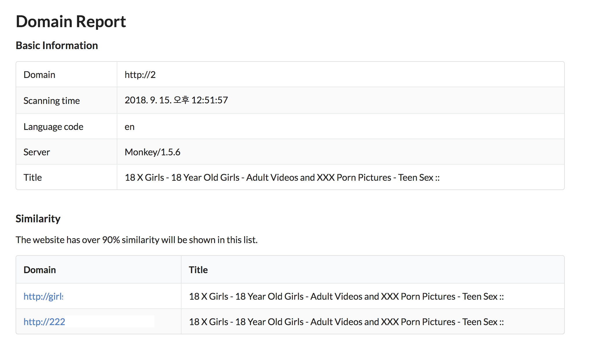
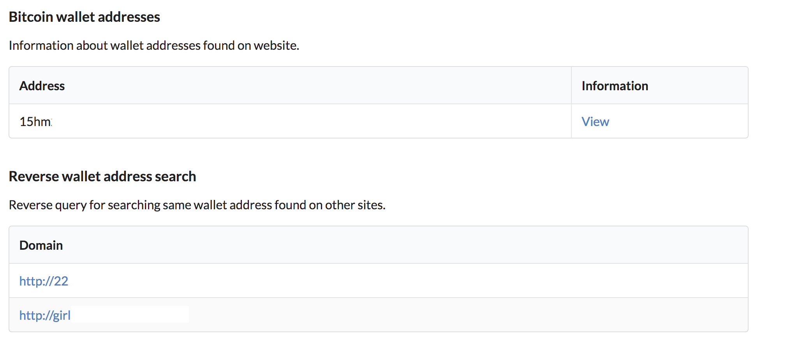
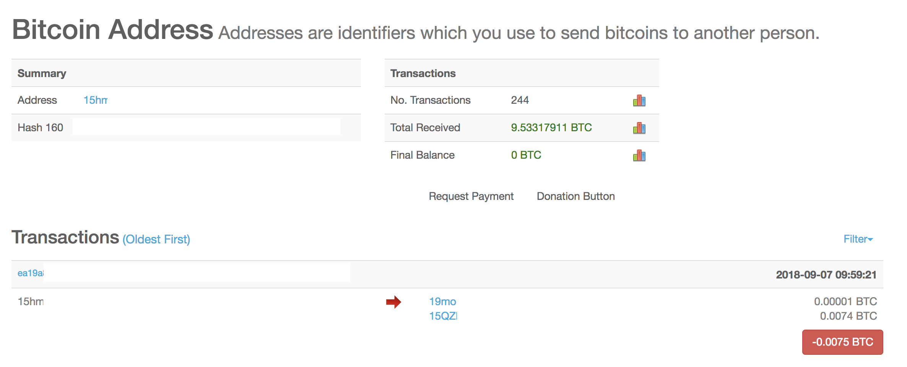
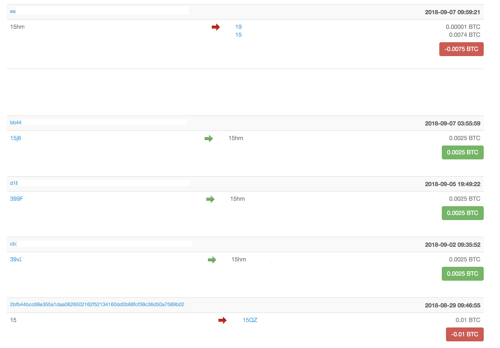
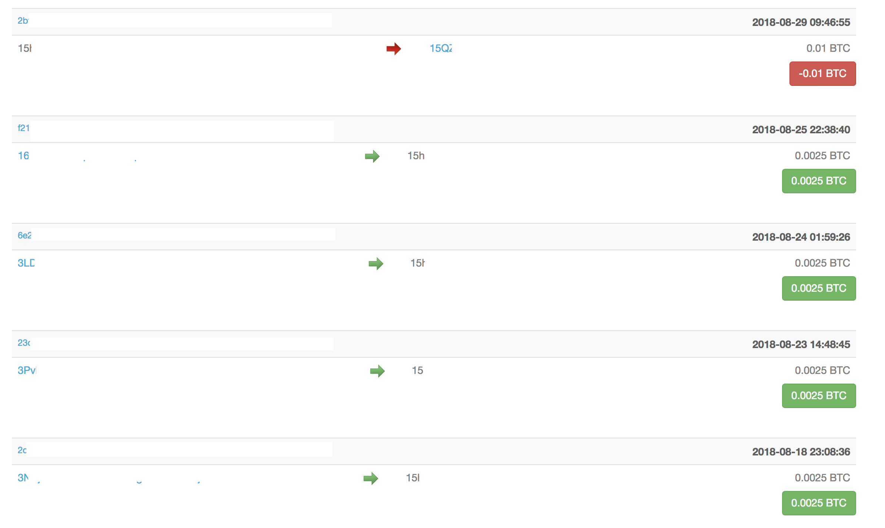
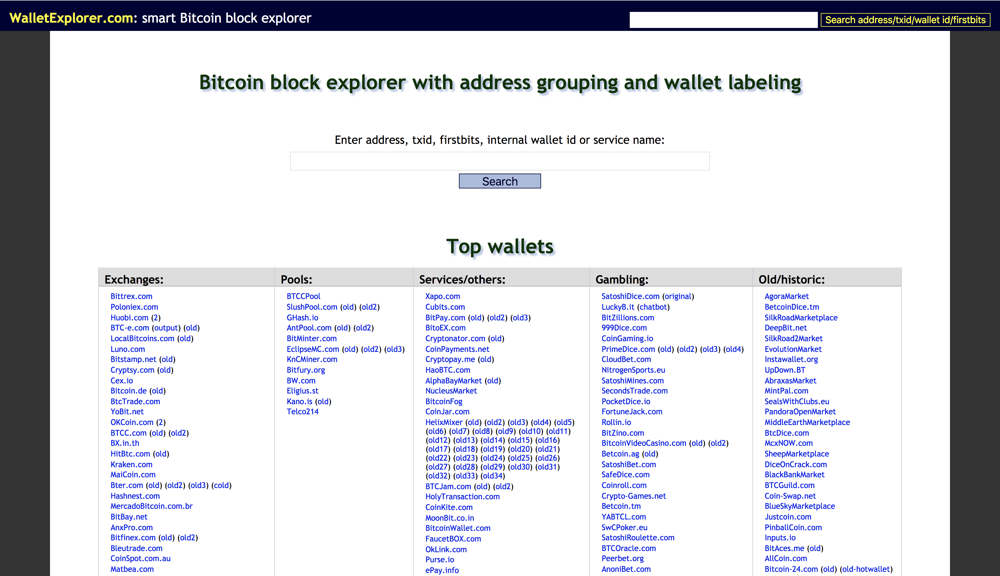
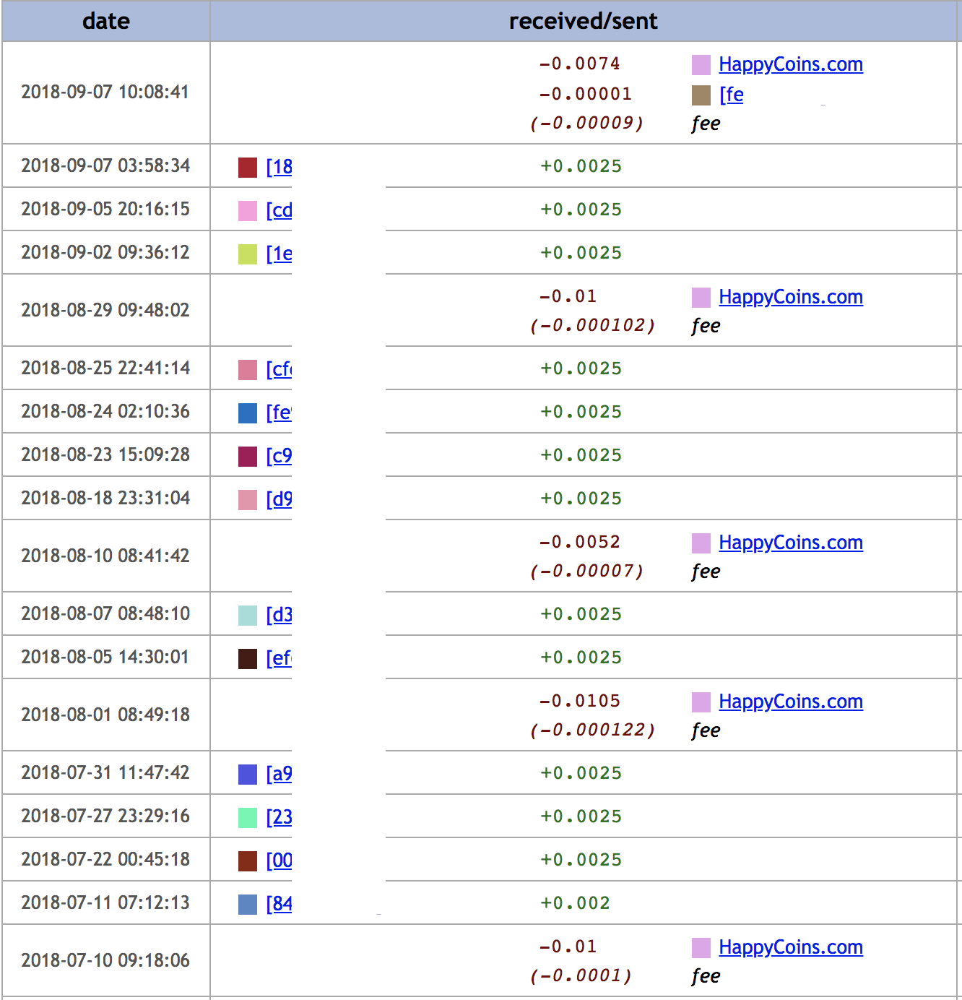
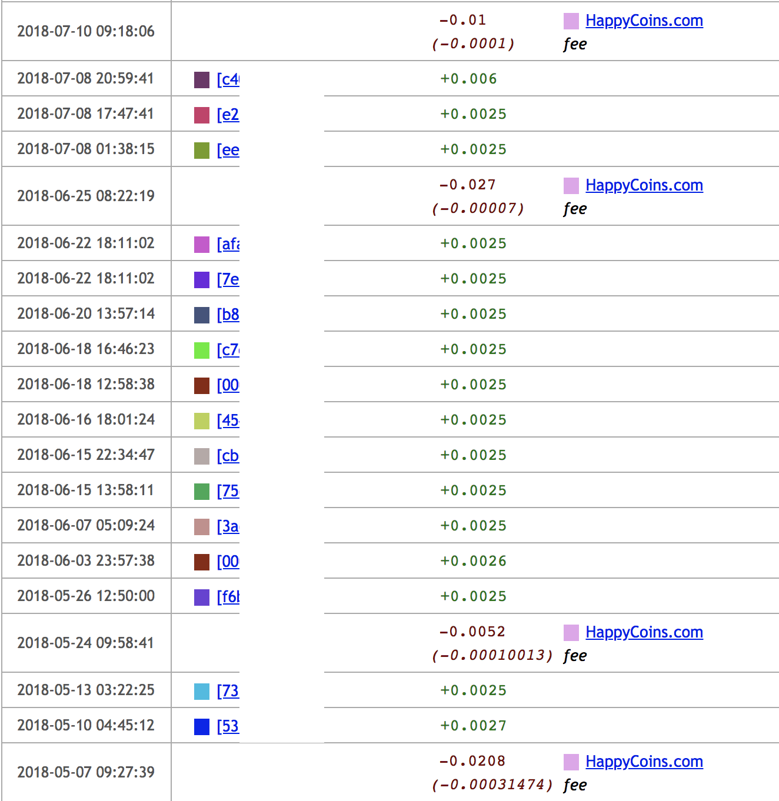
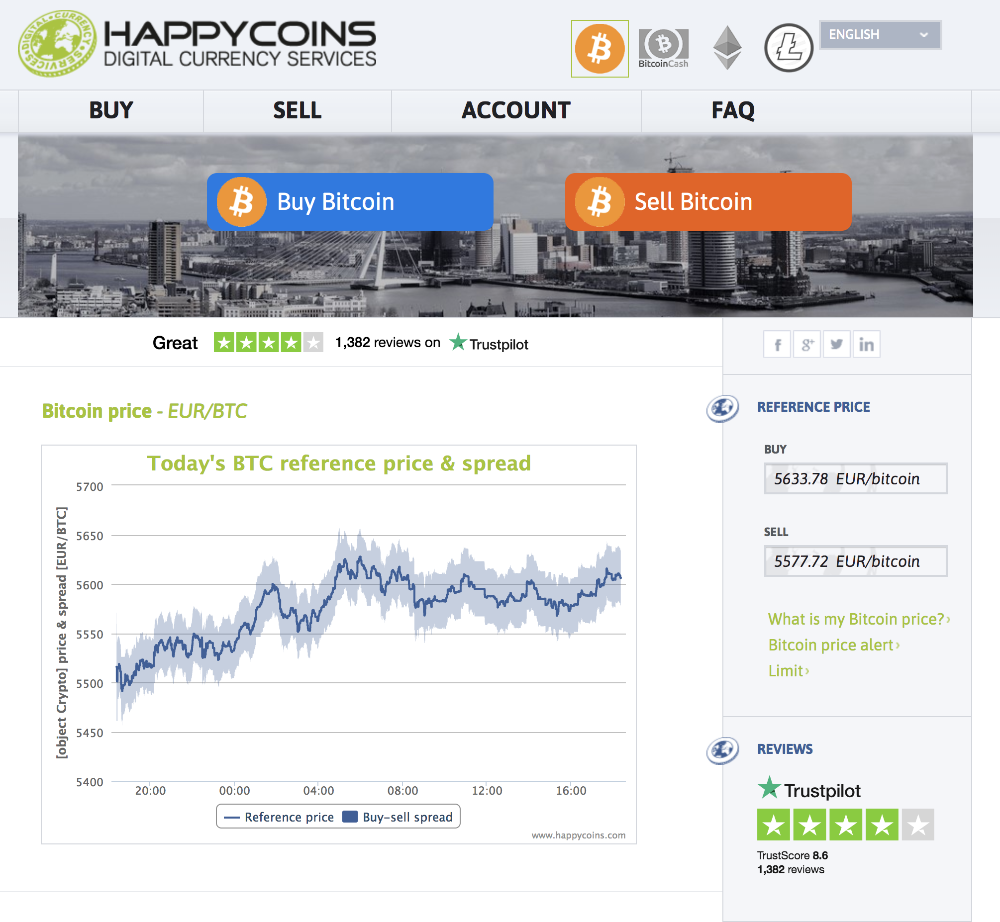
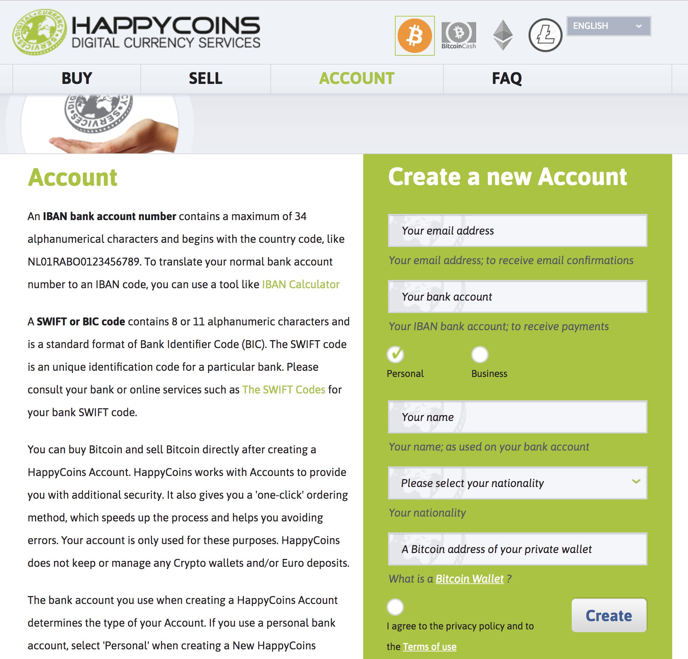

## 서론

항상 이러한 종류들의 기사들을 보면서 과연 이런 자금은 어떻게 추적할까 라는 의문이 항상 들었다.

[다크웹 통해 아동음란물 입수 156명 적발...비트코인 거래](https://www.boannews.com/media/view.asp?idx=68989)

비트코인 추적은 원래 불가능 하다고 알려져 있고, 그렇게 다들 알고 있다고 한다. (그런가?)

그래서 평소에 이런 기사들을 보면서 한번 자금 추적을 해볼 수 있는 기초 정보를 수집하면 좋지 않을까 라는 생각을 항상 가지고 있었다.

그러면서 자연스럽게 다크웹 정보를 수집해서 정리하고 싶었고, 그 계기로 인해 [DarkLight](https://darklight.kr) 이라는 프로젝트를 개인적으로 진행하여 개발을 하게 되었다.

그리고 미리 말하는데 누가 사고 팔았는지에 대한 상세한 정보 같은건 없다. 그냥 어떻게 했는지 개략적으로만 설명했다.

## 검색하기

사실 이 글에서 이런 이야기를 하기 전에 개발에 대한 썰을 좀 더 풀고 싶었지만, 이건 나중에 기회가 된다면 풀도록 하는게 더 좋을거 같다.

일단 사이트에 들어가서 수집한 정보를 보다가 우연하게 좋은 정보를 찾게 되었다.

사이트의 유사도를 평가해서 다른 유사한 사이트를 검색해주는 기능인데 일단 같은 사이트가 여기 말고도 두 곳이 더 있는 것을 찾을 수 있었다.

데이터를 많이 보면서 느낀건 생각보다 유사한 사이트가 많다. 다들 프레임워크를 쓰는건지 아니면 돌려쓰기를 하는건지..

그리고 아래 보면 비트코인 지갑 주소에 대한 정보와 이 주소가 발견된 다른 사이트 정보를 보여주는데, 여기에도 같은 지갑을 찾을 수 있었다.

Reverse wallet address search 라는걸 제공 하는데 이걸 기반으로 같은 wallet 을 사용하는 darkweb 사이트의 리스트를 알 수 있다.

## 지갑을 뜯어보자

일단 지갑 정보 보기를 누르게 되면 blockchain.info 의 해당 주소 정보를 보여주게 된다.

이 정보를 보면 해당 주소에서 약 9.53 BTC 정도를 받은 것을 확인 할 수 있다. (비트코인 500만원 기준 약 4천 5백만원..)

사실 생각보다 장사가 잘 되는 것 같진 않다. (물론 이것 만 가지곤 특정하긴 어렵다. 기사보면 수백 BTC씩 받았으니깐..)

일단 여기 Transaction 들을 보면 아래와 같은 특징을 찾을 수 있다.

일단 사용자에게서 0.0025 BTC (약 2만원) 정도를 받고 이게 3-4명에게서 받게 되면 "15QZ" 로 시작하는 다른 지갑으로 빼는 특징을 발견할 수 있었다. (가린 이유는 가입해서 데이터 검색하면 찾을 수 있게 하기 위해서.. 입니다. - 가입하세요 여러분)

## 그럼, 누가 사고 파는가

우리는 아직 비트코인이 기축통화인 세상에 살고 있지 않다. 개인 간 거래가 아닌 이상 비트코인은 거래소에서 사야 한다. (X썸, X인원, X비트 라던지..)

그리고 사이트를 운영하는 사람도 이 돈을 결국 현금화 해야 하기에 거래소를 이용해서 현금화 할 것이다 라는 1차 가정을 세웠다.

여기서 문제가 있는데 그건 바로 이 지갑이 거래소 지갑인지, 아니면 개인 지갑인지를 알 수 없다 라는게 문제였다.

그러나.. 세상은 위대하고 나랑 비슷한 생각을 하는 사람은 많다.

walletexplorer 라는 서비스가 있는데 이 서비스는 wallet address를 grouping 해주고 label 해주는 사이트이다. (대단)

일단 해당 정보가 정확한진 알 수 없지만, 그래도 여기 계신 개발자 분들이 Chainalysis 이라는 곳에 갔으니 믿을 만 해서 검색해 보니..

사람들이 보낸 돈은 모두 HappyCoins.com 이라는 곳으로 일정 시간마다 빠져 나갔다. 그것도 약속이나 한 것 처럼 모두 오전 9시에서 9시 사이에 빠져 나갔다. (이분은 방귀도 일정 시간마다 뀔 거 같다.)

이 HappyCoins.com 이라는 서비스에 들어가 보니 유로화(EUR)로 buy/sell 할 수 있는 거래소였다!

그리고 해당 사이트에 새로 가입하는 과정에 대해서 살펴 보았는데 여기선 IBAN Account Number 를 요청했다.

사실 처음엔 IBAN이 특정 은행인줄 알았지만.. International Bank Account Number 이라는 유럽 연합이나 중동 쪽에서만 주로 사용하는 국제은행계좌번호(?) 이라고 한다. [참고 링크](https://en.wikipedia.org/wiki/International_Bank_Account_Number)

이걸 통해서 판매자는 유럽 연합 또는 중동 쪽에 주거지를 둔 사람 일 것이라는 추측이 가능하다 (이건 진짜 추측이다)

사실 중간에서 이 거래소를 통해서 다른 곳으로 송금했을 가능성도 충분히 있다. 그러나 이 부분을 추적하기 위해선 내가 공부를 더 해야할 것 같다.

## 마지막으로

뭔가 중간에 말 하다가 끝난 것 같지만 끝난건 사실이다. (이제 노트북 배터리가 부족해 간다.)

사실 자금 흐름을 상세하게 추적하고, 범죄자를 특정 한다는건 내가 할 수 없는 일이다. (권한이 없는데..)

그러나 이렇게 공개된 정보를 가지고도 간략한 정보 정도는 충분히 뽑아낼 수 있다 라는 것을 보여주기 위해 글을 쓰게 되었다.